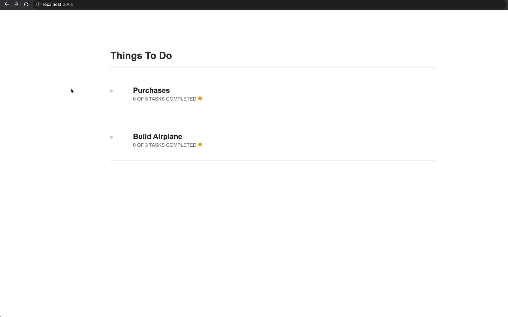

# Coding Challenge

## How to run this code

1. Let's start by installing the supported language versions. If using `asdf` to manage versions (highly recommeded), then run `asdf install` inside the root folder of this project to install Erlang, Elixir and NodeJS. If not using `asdf`, then check for the supported versions on the `.tool-versions` file and install them accordingly.

2. Make sure PostgreSQL is running locally and accepting connections with credentials for `username: "postgres", password: "postgres"`. If that's not the case, then make sure to update `config/dev.exs` with the proper access credentials.

3. Enter the _backend_ folder and run `mix deps.get` to install dependencies. Then, run `mix ecto.setup` to compile the project, create the database, run migrations and insert seed data.

4. Start the backend server with `iex -S mix` or `mix phx.server`. No need to worry about the Node.js error since this app is strictly API and will not be serving static assets.

5. Open a new terminal tab, go to the _frontend_ folder. Run `npm install` to install the frontend dependencies and then `npm start` to spin up the front-end app.

5. Access the app at http://localhost:3000 and it should look like so:





## Coding Challenge

The coding challenge revolves around building a task list. Tasks belong to groups and can have
dependencies on one another (i.e. if task X depends on task Y, task X cannot be completed until
task Y is completed). The challenge includes 3 components:

* Build React-based UI
* Design database schemas to store todo's using Ecto
* Implement GraphQL resolver logic in elixir

### Build React-based UI

The UI consists of 2 screens:

* **Overview**: Displays a list of all the groups along with their completion status. Clicking on 
  a group should render the detail screen.

* **Detail**: Displays a list of all the tasks in the selected group and allows the user to toggle 
  the completion status of unlocked tasks.

The screens should look like this:


The data you should use to populate your implementation is available via a simple GraphQL query which is already included. 
SVG assets for the icons used in the design can be found in the _public/_ directory.

Some things to keep in mind:

* Locked tasks cannot have their completion status toggled
* Tasks remain locked until all of their dependencies have been completed
* Marking a task as incomplete should lock the corresponding tasks for which it is a dependency
* Your implementation should resemble the above design
* **Please don't introduce any new dependencies**, you should have everything you need to complete
  the challenge
* We value well structured code that follows best practices

### Design and Build Database Schema

Design a schema to store the task list data. You should use Ecto migrations to create
the tables needed. The schema should define all tables, columns, and constraints needed
to store the task list data.

### Implement schema modules and context

Implement the corresponding schema modules for each new table designed in the previous step (structs or emedded schemas are permittable, as well, depending on your database implementation). Typespecs with Dialyzer are definitely favored.

Write a context that manage's your todo's and interacts with the repo. Please be wary of naming and director structure conventions.

### Implement GraphQL schemas & resolver

Build a schema using Absinthe's schema notation to dictate object and input object structures. Please include queries and mutations for managing todo's from you UI.

The backend implementation has a stub implementation for the all todo's resolver. Replace this stub with an actual resolver that calls to the context that you implemented in the previous step.

## Getting Started

### Backend
Depending on your environment you might have to fist have to install all dependencies to run the elixir backend. Please see the [phoenix getting started documentation](https://hexdocs.pm/phoenix/installation.html) for more details.
Once you have all needed dependencies installed start the server by standing in the _/backend_ folder and run:

```
mix phx.server
```

### Frontend
To get started, clone this repo to your local machine. Next you'll want to install the dependencies
and fire up the app:

```
yarn install
yarn start
```

At this point, the app should be running in development mode and any local modifications you make
will be automatically detected and result in the app to reload.

## Things to note

1. Typespecs for Elixir code are appreciated
2. Testing is favored if time permits, but given possible time constraints, we understand if this is cut short
3. Using modern React conventions is preferred, e.g. dumb components, hooks, etc
4. Please avoid using Phoenix generators for context functionality; we'd rather see your code and your patterns :)
5. Have fun with it! We understand that coding challenges are a pain, but we really appreciate your participation in this process!
6. If you have any you any questions or special circumstances, we are more than willing to work with you on having the best possible interview process.
